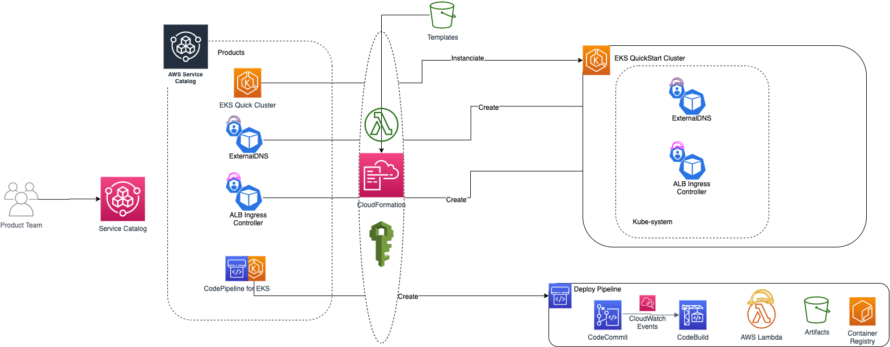
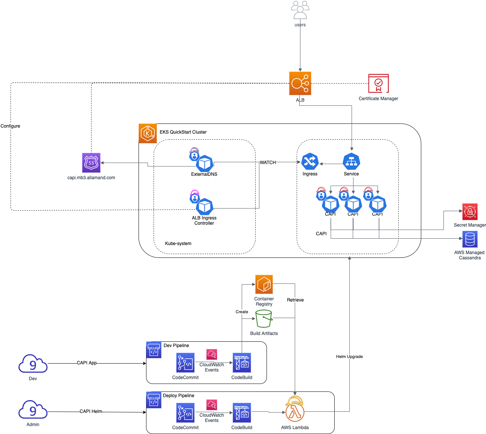

# EKS Service Catalog blueprint

It is common pattern for AWS customers to be able to provide IT as a service for their products teams.
For instance, giving the ability for developers to be able to quickly deploy and uses AWS services in
order to allow them to build & deploy new products for their own customers.

With this repository we will see how to leverage Service Catalog, in order to let IT team construct common
deployment patterns to be then uses in self-service mode by developers.

We will uses Service Catalog to build an EKS environment and a CodePipeline to automatically build and deploy
a sample application in our EKS cluster. we will see:

- The creation of standardized EKS Cluster
- The deployment of Kubernetes add-ons such as ALB ingress controller and ExternalDNS.
- The creation of CodePipeline to have Devops teams create Continuous Deployment pipeline for their application.

## What is AWS Service Catalog

AWS Service Catalog is used to provides self service deployment of AWS services and application in your AWS environment.

The AWS Service Catalog will allow administrators and product teams to provide standarization, ease governance
controls and increase security by provided a way for teams to create regulated environments.

Administrators can create pre-defined products and defined granular control over which users have access
to which offerings.
Service Catalog makes use of adopted IAM roles so users don't need underlying service access, while providing users
with self-sufficient access to enterprise standards for deployments.

## What we are building:

### Creating Product using Service Catalog



### Continuous Build & Deployment of Application in EKS Cluster




## Pre-requisites for this demo

To follow this demo you'll need to have some pre-requisites
- You need an AWS account :)
- Create a Route53 hosted zone link to your domain name. (in my case this will be mb3.allamand.com)
- Create a wildcart Certificate in Certificate Manager for your hosted zone (ex: *.mb3.allamand.com)
> write down the certificate arn, we will need this later


## Create your Service Catalog

### Setup our Catalog

We uses a CloudFormation template to create :

* A S3 Bucket + Policy to store others CloudFormation templates
* An IAM role *product-team-role* which will be used by Service Catalog product team to launch products.
* * An IAM role *sc-launch-role* which will be used to launch services from catalog


Define the name for your catalog
```
export APPLICATION_NAME=mb3-catalog
```

Then you can create the CloudFormation stack which will setup the environment:
```
aws cloudformation create-stack --stack-name ${APPLICATION_NAME}-setup \
 --template-body file://templates/catalog-setup.yml \
 --capabilities CAPABILITY_NAMED_IAM \
 --parameters ParameterKey=ApplicationName,ParameterValue=$APPLICATION_NAME
```

you can watch the creation status until you get `"CREATE_COMPLETE"`:

```
watch aws cloudformation describe-stacks --stack-name ${APPLICATION_NAME}-setup --query "Stacks[0].StackStatus"
```

The output of the Templates are:

* The S3 bucket name used to store Catalog templates
* The arn of the *sc-launch-roleb*
* The arn of the *product-team-role*

Here we need to retrieve the name of the AWS S3 Bucket in which we will stores our CloudFormation templates for our products:

```
export TEMPLATE_BUCKET_NAME=$(aws cloudformation describe-stacks --stack-name ${APPLICATION_NAME}-setup --query 'Stacks[0].Outputs[?OutputKey==`TemplateBucketName`].OutputValue' --output text)
echo $TEMPLATE_BUCKET_NAME
```

### Copy our Products templates to the S3 Bucket

We Just copy our products templates which will be used when we will launch templates from the Service Catalog

If the environnement is not setup:

```
export APPLICATION_NAME=mb3-catalog
export TEMPLATE_BUCKET_NAME=$(aws cloudformation describe-stacks --stack-name ${APPLICATION_NAME}-setup --query 'Stacks[0].Outputs[?OutputKey==`TemplateBucketName`].OutputValue' --output text)
echo $APPLICATION_NAME $TEMPLATE_BUCKET_NAME
```

- Copy the template to create a EKS QuickStart cluster

```
aws s3 cp templates/amazon-eks-master.template.yaml \
s3://${TEMPLATE_BUCKET_NAME}/amazon-eks-master.template.yaml
```

> Note: this template will trigger official [AWS quickstart templates](https://github.com/aws-quickstart/quickstart-amazon-eks)


- Copy the template to create a Pipeline for our application using CodeBuild

```
aws s3 cp templates/ci-cd-codepipeline.cfn-without-lambda-codebuild.yml \
s3://${TEMPLATE_BUCKET_NAME}/ci-cd-codepipeline.cfn-without-lambda-codebuild.yml
```

- Copy the template to create a Pipeline for our application using GitHub

```
aws s3 cp templates/ci-cd-codepipeline.cfn-without-lambda.yml \
s3://${TEMPLATE_BUCKET_NAME}/ci-cd-codepipeline.cfn-without-lambda.yml
```

- Copy the template used to create our ALB ingress Controller inside our EKS cluster
```
aws s3 cp templates/CF-aws-alb-ingress-controller.yml \
s3://${TEMPLATE_BUCKET_NAME}/CF-aws-alb-ingress-controller.yml
```

- Copy the template used to create the ExternalDNS controller inside our EKS cluster

```
aws s3 cp templates/CF-external-dns.yml \
s3://${TEMPLATE_BUCKET_NAME}/CF-external-dns.yml
```

### Create our AWS Catalog products

This template will create the Service Catalog, exposing different products that are referenced in the catalog and where their associated CloudFormation templates are stores in the S3 Bucket.

First, get the Role name the Catalog will used to create the EKS QuickStart cluster.

```
export EKSQuickStartDeployRole=
```

```
aws cloudformation create-stack --stack-name ${APPLICATION_NAME}-products \
 --template-body file://templates/catalog-products.yaml \
 --parameters ParameterKey=ApplicationName,ParameterValue=$APPLICATION_NAME \
 ParameterKey=TemplateBucketName,ParameterValue=${TEMPLATE_BUCKET_NAME}
```

Watch status creation:
```
watch aws cloudformation describe-stacks --stack-name ${APPLICATION_NAME}-products --query "Stacks[0].StackStatus"
```

> If you want to update the stack
>
> ```
> aws cloudformation update-stack --stack-name ${APPLICATION_NAME}-products \
> --template-body file://templates/catalog-products.yaml \
> --parameters ParameterKey=ApplicationName,ParameterValue=$APPLICATION_NAME \
> ParameterKey=TemplateBucketName,ParameterValue=${TEMPLATE_BUCKET_NAME}
> ```


> /!\ Important: If you have updated a CloudFormation template in the s3, you need to update the templates/catalog-products.yaml with a new version for your file and update the stack!

## Launch products from Service Catalog

We will simulate that our IAM user is part of the Product team by assuming this role within the console:
- Switch to the Role: **$APPLICATION-product-team-role**
- Go to Service Catalog


To work with the Service Catalog, conect to the console and assume the role of *product-team*

### Create the EKS Cluster

#### Create the Stack

This will create the EKS QuickCluster from AWS. more info on : https://github.com/aws-quickstart/quickstart-amazon-eks

This can take up to 30mn to create all elements

Go to CloudFormation and store the Outputs parameters as we will need them.

If you are using a specific IAM user to work on AWS, don't forget to put the arn of your user or role in the **Additional EKS admin ARNs**

in my case I needed to add : `arn:aws:iam::382076407153:user/cdkmb3`

In my example case I add:

```
- EKSClusterName	EKS-NhlPp5YSriC3
- HelmLambdaArn	arn:aws:lambda:us-east-1:382076407153:function:SC-382076407153-pp-guoexe62p4rrq-EKSSta-HelmLambda-AYWSZM2IW0XQ
- KubeConfigPath	s3://sc-382076407153-pp-guoexe62p4rrq-kubeconfigbucket-t3lo35vllxjt/.kube/config.enc
- KubeGetLambdaArn	arn:aws:lambda:us-east-1:382076407153:function:SC-382076407153-pp-guoexe62p4rrq-EKS-KubeGetLambda-NVRTQI2MW1XN
- KubeManifestLambdaArn	arn:aws:lambda:us-east-1:382076407153:function:SC-382076407153-pp-guoexe62p4rr-KubeManifestLambda-2A0DUIL8ENL4
- NodeGroupSecurityGroup	sg-0e0ec804f03818d2b
```

#### Configure the OIDC Provider

In order to be able to make uses of the IRSA (IAM Role for Service Accounts), we need to activate the oidc provicer for our EKS cluster in IAM

```
eksctl utils associate-iam-oidc-provider --cluster <your EKS cluster name> --approve
```

Note the OIDC Provider name from your EKS console. Example in my case :
```
OIDCProvider oidc.eks.us-east-1.amazonaws.com/id/4F9496D7909B01C706AF9112F12AF099
```
Even if we have not created our cluster with eksctl, we can use it to leverage this action easilly :)

#### Configure your access to your EKS Cluster with kubectl

You now need to ask eks to configure your local kubectl so that you can access to your EKS cluster

```
aws eks update-kubeconfig --name EKS-NhlPp5YSriC3
```


### Create the ALB Ingress Controller

The ALB Ingress Controller will allow you to publish your services on the internet using an AWS Application Load Balancer.
This is powerful scalable loadbalancer managed for you by AWS.

Launch ALB Stack and fill it with informations received from your EKS stack

The Stack will ask for parameters, here an example with my values:
1. Choose a name for the product : **ALB**
2. Name of OIDC Provider from EKS: **oidc.eks.us-east-1.amazonaws.com/id/4F9496D7909B01C706AF9112F12AF099**
3. The EKS cluster name: **EKS-NhlPp5YSriC3**
5. KubeConfigPath from EKS stack Outputs: **s3://sc-382076407153-pp-guoexe62p4rrq-kubeconfigbucket-t3lo35vllxjt/.kube/config.enc**
6. HelmLambdaArn from EKS stack Outputs:
8. keep the default for others

> replace with your values

Let the others options as default and Launch the stack.

> The Service Catalog will create a Role and Policy for our ALB. It will then create the ALB Controller from the official Helm Chart
which will be deploy thanks to a dedicated Lambda Function that extends CloudFormation features (Custom Ressources)

### Create the ExternalDNS controller

The ExternalDNS will allow you to automatically create entries in your Route53 hosted zone, when you deploy ingress in your EKS cluster.
The DNS entry will be automatically mapped to the ALB created by the ALB ingress controller.

Go to Service Catalog on click on **ExternalDNS Controller** product.

Example with my values:

1. Choose a name for the product : **externalDNS**
2. filter the domain: **demo3.allamand.com** (your hosted zone)
3. choose the ExternalDNS option policy. I like to chosse **sync**, it will synchronize creation and deletion of entries.
4. choose the EKS cluster name: **EKS-NhlPp5YSriC3**
5. KubeConfigPath from EKS stack Outputs: **s3://sc-382076407153-pp-guoexe62p4rrq-kubeconfigbucket-t3lo35vllxjt/.kube/config.enc**
6. Name of OIDC Provider from EKS: **oidc.eks.us-east-1.amazonaws.com/id/4F9496D7909B01C706AF9112F12AF099**
7. HelmLambdaArn from EKS stack Outputs:
8. keep the default for others

> replace with your values

> The Service Catalog will create a Role and Policy for our ExternalDNS. It will then create the Controller from the official Helm Chart
which will be deploy thanks to a dedicated Lambda Function that extends CloudFormation features (Custom Ressources)

### Create A CodePipeline to deploy service in EKS

With this product we want to be able to provide for each of our developers teams, a way to automate a delivery
pipeline for their application directly to the EKS Cluster.

This button will create for us a CodePipeline pipeline, with a CodeCommit repository into store our code, and a CodeBuild that
will be configured by the `buildspec.yaml` file that our dev team will create in their codeCommit repo.

1. The Idea here is that we can leverage for instance a Pipeline for our Dev team to build/test and provide artifacts for this build.
2. Another pipeline which can be mastered by the operational team wich will be triggered when new build artifacts has been created in the dev pipeline and then will trigger the deployment in the EKS cluster.

Using this way we can let the dev build their product and the Ops team to keep the way and usage on the cloud platform.

To create a pipeline, select the **EKS Build Pipeline Tools With CodeCommit** product.


1. Choose a name for the product : **capi-dev**
2. choose the EKS cluster name: **EKS-NhlPp5YSriC3**
3. Choose the branch on which trigger the build: **master**


## Deploy our Cassandra API Demo

We will uses our build and deployment pipeline we just created to deploy [CAPI](https://githib.com/allamand/capi), a Cassandra rest API demo in Go

The project will be copied in a CodeBuild Repo.

### Satisfy the pre-requisites

You can find in the project repo some [pre-requisites](https://github.com/allamand/capi#manual-pre-requisites) you need to fullfill before launching the pipeline.
This is just a decap of them:
- Create Cassandra Credentials for the AWS Managed Cassandra Service
- Create a Secret in AWS Secret Manager in order to store the Cassandra credentials
  - the Go application will have IAM role which authorize it to retrieve the secret and then be able to connect to Cassandra
- Create the IAM role to be used by the CAPI pods

Create Cassandra credentials for my user **cdkmb3**
```
AWS_USER=cdkmb3
CASSANDRA_CREDS=$(aws iam create-service-specific-credential \
--user-name $AWS_USER \
--service-name cassandra.amazonaws.com)
```

Create the Cassandra Secret to store thoses credentials

```
aws secretsmanager create-secret --name cassandra --secret-string "{\"username\": $(echo $CASSANDRA_CREDS | jq '.ServiceSpecificCredential.ServiceUserName'),\"password\": $(echo $CASSANDRA_CREDS | jq '.ServiceSpecificCredential.ServicePassword')}"
```

From the **capi** repository launch the CloudFormation stack to create the CAPI Role

```
aws cloudformation create-stack --stack-name capi-role \
--template-body file://CF-iam-role-capi.yaml \
--capabilities CAPABILITY_NAMED_IAM \
--parameters ParameterKey=SecretArn,ParameterValue=arn:aws:secretsmanager:us-east-1:382076407153:secret:cassandra-6ozDEb \
ParameterKey=KubeOIDCProvider,ParameterValue=oidc.eks.us-east-1.amazonaws.com/id/4F9496D7909B01C706AF9112F12AF099
```

### Configure the pipeline

Then, as describe [here](https://github.com/allamand/capi#configure-the-pipeline), you need to add additionals Environments paramers to the CodeBuild project in order to be able to deploy the CAPI in the EKS cluster

In this example, I will uses:

- **DOMAIN** - capi.demo3.allamand.com
- **CERTIFICATE_ARN** - arn:aws:acm:us-east-2:382076407153:certificate/ea403661-91ce-4149-adff-dc4b89126d25
- **SERVICE_ACCOUNT_ROLE_ARN** - arn:aws:iam::382076407153:role/capi-role-CAPIRole-1JD6TZIKGUT5Y
- **CODE_PIPELINE_ARTIFACT_BUCKET** - sc-382076407153-pp-u37xb-codepipelineartifactbuck-1gl9kzny6npwr
- **NAMESPACE** - capi

> You can't change the Namespace in the environment variable, if you don't change the Namespace in the CF-iam-role-capi.yaml CloudFormation template which creates the CAPI IAM Role.

Go to CodeCommit to retrieve the connections parameters to your repository.

> /!\ Actually the EKS_KUBECTL_ROLE_ARN define in the pipeline is not correctly added to the aws-auth ConfigMap, so you need to manually
add it

```
kubectl -n kube-system edit cm aws-auth -o yaml
```

add this section in RoleMaps (change with your EKS_KUBECTL_ROLE_ARN from your codebuild env vars)
```
    - groups:
      - system:masters
      rolearn: arn:aws:iam::382076407153:role/SC-382076407153-pp-u37xbryirghgm-KubectlRoleName
      username: arn:aws:iam::382076407153:role/SC-382076407153-pp-u37xbryirghgm-KubectlRoleName
```

Clone the repo from Github:

```
git clone https://github.com/allamand/capi.git
```

add a new remote repository to your codeCommit repo

```
git remote add codecommit codecommit::us-east-1://SC-382076407153-pp-u37xbryirghgm
```

> If you don't already install git-remote-codecommit :
> ```
> pip install git-remote-codecommit
> ```

Then push your code to the CodeCommit repository:

```
git push codecommit master
```

Wait a little, and a new pipeline should automatically triggered


## License Summary

This sample code is made available under the MIT-0 license. See the LICENSE file.

